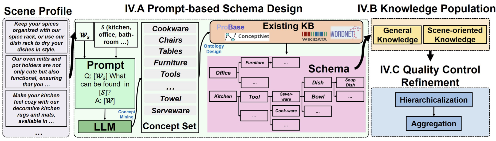
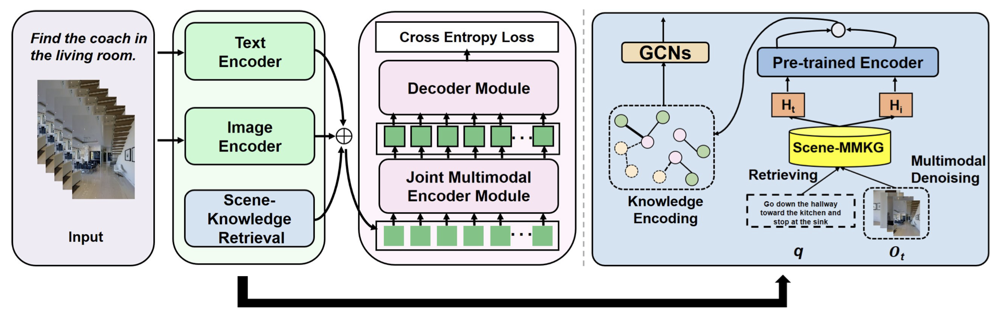

# ManipMob-MMKG

## About

Code for the paper ["Scene-Driven Multimodal Knowledge Graph Construction for Embodied AI"](https://arxiv.org/abs/2311.03783)
Our website is in [ManipMob-MMKG](https://sites.google.com/view/manipmob-mmkg)

## Scene-MMKG Construction


Given the scene profiles, we design a prompt-based schema based on LLMs and then populate multimodal knowledge guided by the schema to construct our Scene-MMKG. Scene-MMKG is refined by hierarchicalization and aggregation for attributes to resolve long-tail problems.

## Scene-driven Knowledge Enhancement Model



The overview of the scene-driven knowledge enhancement model is shown in the left panel. The right panel is the details about scene knowledge retrieval module.

## How to run?

For three sub-works, please visit each subfolder for information such as environmental requirements, data downloads, and run steps.

* Scene MMKG Construct: about the specific steps for the construction of scene mmkg.
* Visual Language Navigation ManiMob: about the application of ManiMob-MMKG inject into VLN task.
* 3D Object Language Grounding ManiMob: about the application of ManiMob-MMKG inject into 3D Object Language Grounding task.

## Acknowledgement

The code of two downstream tasks in this work is built upon [CKR](https://github.com/alloldman/CKR) and [snare](https://github.com/mushorg/snare). And thanks them for their great works!

## How to Cite
```
@misc{yaoxian2023scenedriven,
      title={Scene-Driven Multimodal Knowledge Graph Construction for Embodied AI}, 
      author={Song Yaoxian and Sun Penglei and Liu Haoyu and Li Zhixu and Song Wei and Xiao Yanghua and Zhou Xiaofang},
      year={2023},
      eprint={2311.03783},
      archivePrefix={arXiv},
      primaryClass={cs.AI}
}

